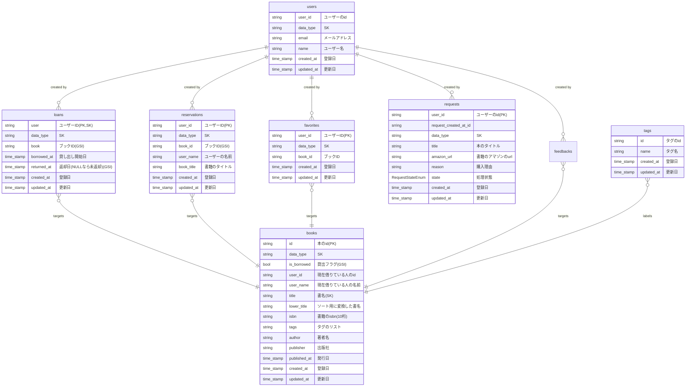

```mermaid
erDiagram
users {
        string user_id "ユーザーのid"
        string data_type "SK"
        string email "メールアドレス"
        string name "ユーザー名"
        time_stamp created_at "登録日"
        time_stamp updated_at "更新日"
    }
books {
        string id "本のid(PK)"
        string data_type "SK"
        bool is_borrowed "貸出フラグ(GSI)"
        string user_id "現在借りている人のid"
        string user_name "現在借りている人の名前"
        string title "書名(SK)"
        string lower_title "ソート用に変換した書名"
        string isbn "書籍のisbn(10桁)"
        string tags "タグのリスト"
        string author "著者名"
        string publisher "出版社"
        time_stamp published_at "発行日"
        time_stamp created_at "登録日"
        time_stamp updated_at "更新日"
    }

    loans {
        string user "ユーザーID(PK,SK)"
        string data_type "SK"
        string book "ブックID(GSI)"
        time_stamp borrowed_at "貸し出し開始日"
        time_stamp returned_at "返却日(NULLなら未返却)(GSI)"
        time_stamp created_at "登録日"
        time_stamp updated_at "更新日"
    }

    reservations {
        string user_id "ユーザーID(PK)"
        string data_type "SK"
        string book_id "ブックID(GSI)"
        string user_name "ユーザーの名前"
        string book_title "書籍のタイトル"
        time_stamp created_at "登録日"
        time_stamp updated_at "更新日"
    }

    favorites {
        string user_id "ユーザーID(PK)"
        string data_type "SK"
        string book_id "ブックID"
        time_stamp created_at "登録日"
        time_stamp updated_at "更新日"
    }

    requests{
        string user_id "ユーザーのid(PK)"
        srring request_created_at_id ""
        string data_type "SK"
        string title "本のタイトル"
        string amazon_url "書籍のアマゾンのurl"
        string reason "購入理由"
        RequestStateEnum state "処理状態"
        time_stamp created_at "登録日"
        time_stamp updated_at "更新日"
    }


tags {
        string id "タグのid"
        string name "タグ名" 
        time_stamp created_at "登録日"
        time_stamp updated_at "更新日"
    }

feedbacks {
        
    }

    
    users ||--o{ favorites : "created by"
    users ||--o{ loans : "created by"
    users ||--o{ reservations : "created by"
    users ||--o{ feedbacks : "created by"
    users ||--o{ requests : "created by"
    loans }o--|| books : "targets"
    reservations }o--|| books : "targets"
    favorites }o--|| books : "targets"
    feedbacks }o--|| books : "targets"
    tags }o--|| books : "labels"
```

